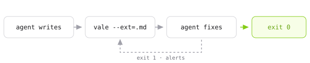

# Voices

**The [output-style catalog][catalog] as a linter.** Six writing voices,
written as [Vale][vale] rules instead of prompts: checked exhaustively,
reported with the exact span and the fix, and costing nothing until the prose
breaks one.

[catalog]: https://github.com/smixs/awesome-claude-output-styles#the-styles
[vale]: https://vale.sh

```ini
Packages = https://github.com/jdkato/voices/releases/latest/download/Voices.zip

[*.md]
BasedOnStyles = Voices, Direct
```

```console
$ vale sync
```

---

Everybody writing a house style for an agent writes it as a prompt. Thirty
banned words and a dozen patterns, loaded into context every session, applied
from memory, and verified by the same model that wrote the draft.

It is the same trade [Swizec ran on code review][swizec]: a reviewer that
reads everything, costs tokens per run, and is pedantic in ways nobody asked
for — replaced by a linter that answers in milliseconds, gives the same answer
every time, and runs in a hook so the agent fixes its own output before anyone
sees it.

[swizec]: https://swizec.com/blog/stop-burning-tokens-on-code-review

<picture>
  <source media="(prefers-color-scheme: dark)" srcset=".github/assets/loop-dark.svg">
  
</picture>

Vale reads stdin and sets an exit code, so nothing else is involved. No
server, no MCP, no API key.

## One draft, six voices

The same hedged paragraph, checked against each voice and then rewritten
until Vale returned zero. Every rewrite below is a file in
[`fixtures/after/`](fixtures/after); CI fails if any of them stops coming
back clean.

<table>
<tr>
<th align="left" width="50%">Draft &nbsp;·&nbsp; <code>exit 1</code></th>
<th align="left" width="50%"><code>Voices, Direct</code> &nbsp;·&nbsp; <code>exit 0</code></th>
</tr>
<tr valign="top">
<td>

```markdown
# Understanding Why Your Component Keeps Re-Rendering

Here's the thing: it's worth noting that the reason your
React component is re-rendering is likely because you're
creating a new object reference on each render cycle,
which breaks React's referential equality check — so you
may want to consider memoization.

This is not just a performance problem, it's a
correctness problem. Furthermore, experts agree that a
robust approach to this paradigm shift will empower your
team to streamline a number of things in the render
path, underscoring its significance.

In conclusion, the team made a decision to leverage
several caching solutions.
```

</td>
<td>

```markdown
# Understanding Why Your Component Keeps Re-Rendering

Your component re-renders because you create a new
object on every render. React compares props by
reference, and a new reference is never equal to the old
one. The memo check fails, so the child renders again.

Wrap the object in `useMemo` with the values it depends
on. If it never changes, move it out of the component.
```

</td>
</tr>
</table>

Seventeen alerts stood between the two:

```console
$ vale draft.md
 draft.md
 3:1    error  Sentence runs to 45 words. Split it.                                                         Direct.Length
 3:1    error  Throat-clearing: 'Here's the thing'. Cut it and state the point.                             Voices.ThroatClearing
 3:19   error  Hedge: 'it's worth noting'. State it, or say why you're unsure.                              Direct.Hedging
 3:42   error  Preamble: 'the reason your React component is'. Lead with the finding.                       Direct.Preamble
 4:33   error  Hedge: 'is likely because'. State it, or say why you're unsure.                              Direct.Hedging
 7:1    error  Hedge: 'may want to consider'. State it, or say why you're unsure.                           Direct.Hedging
 9:6    error  Binary contrast: 'is not just a performance problem, it's'. State the second half directly.  Voices.BinaryContrast
 10:22  error  Sentence runs to 28 words. Split it.                                                         Direct.Length
 10:35  error  Weasel attribution: 'experts agree'. Name the source or cut the claim.                       Voices.Weasel
 11:1   error  Inflated word: 'robust'. Say the plain thing.                                                Voices.Banned
 11:25  error  Inflated word: 'paradigm shift'. Say the plain thing.                                        Voices.Banned
 11:45  error  Inflated word: 'empower'. Say the plain thing.                                               Voices.Banned
 12:9   error  Inflated word: 'streamline'. Say the plain thing.                                            Voices.Banned
 13:5   error  Superficial analysis: ', underscoring'. Say what it does for the reader.                     Voices.SuperficialAnalysis
 15:1   error  Recap ending: 'In conclusion'. End on the last concrete point.                               Voices.Recap
 15:25  error  Weak verb phrase: use 'decided' instead of 'made a decision'.                                Voices.WeakVerbs
 15:44  error  Inflated word: 'leverage'. Say the plain thing.                                              Voices.Banned

✖ 17 errors, 0 warnings and 0 suggestions in 1 file.
```

Every one carries a line, a column, and the span. `Voices.WeakVerbs` carries
the replacement text as well, so an agent can apply it without thinking about
it.

Three of the others are worth opening, because each one is a constraint a
prompt states and a model then has to hold in its head.

<details>
<summary><b>Simple</b> — only the 850 words of Basic English</summary>

<br>

C. K. Ogden's 1930 vocabulary, expanded to the regular inflections the system
allows and shipped as a Hunspell dictionary. The heading had to go too:
*understanding* and *component* are not on the list.

```console
  1:3  'Understanding' is outside Basic English. Say it in shorter words.  Simple.Vocabulary
 1:26  'Component' is outside Basic English. Say it in shorter words.      Simple.Vocabulary
  3:1  'Here's' is outside Basic English. Say it in shorter words.         Simple.Vocabulary
 3:24  'worth' is outside Basic English. Say it in shorter words.          Simple.Vocabulary
  4:1  'React' is outside Basic English. Say it in shorter words.          Simple.Vocabulary
  4:7  'component' is outside Basic English. Say it in shorter words.      Simple.Vocabulary
       ... 38 more
```

```markdown
# Why your page part is made again and again

Your part of the page is made again and again. Every
time it is made, you give it a new box of values. The
system does not look inside the box. It only sees that
the box is new, so it does all the work again.

Keep the same box. Make the box once, and give that same
box every time. Then the system sees no change, and it
does no work.
```

Forty-four of the fifty-five alerts on this draft are vocabulary; the rest
come from the shared core. A closed vocabulary is the constraint a model
cannot hold and a lookup table gets exactly right.

</details>

<details>
<summary><b>GenZ</b> — one slang term a sentence, two a paragraph, at least one</summary>

<br>

The source style asks the model to verify its own slang density by re-reading
the draft and counting. Counting is the one thing a rule does exactly, and
`min` makes the absence of a voice a violation too.

```console
   1:1  No slang in this paragraph. This voice is not off.  GenZ.Presence
 10:22  Corporate register: 'Furthermore'. Not this voice.  GenZ.Register
```

```markdown
# Understanding Why Your Component Keeps Re-Rendering

Your render path is cooked. You build a new object every
render, and React compares props by reference. A new
reference never equals the old one, so the memo check
fails and the child renders again.

Wrap the object in `useMemo` with the values it depends
on. Stable reference, clean diff, massive W.
```

</details>

<details>
<summary><b>Brevity</b> — six-word headlines and a required "Why it matters:"</summary>

<br>

`occurrence` with `min: 1` is the only shape of rule that can require
something be *present*, which is how a format becomes checkable rather than
merely described.

```console
   1:1  No 'Why it matters:' section. Say why the reader should care.  Brevity.WhyItMatters
   3:1  Sentence runs to 45 words. Smart Brevity caps it at twenty.    Brevity.Length
 10:22  Sentence runs to 28 words. Smart Brevity caps it at twenty.    Brevity.Length
```

```markdown
# New object, new reference

Your component re-renders because you build a new object
every render. React compares props by reference. A new
reference never equals the old one.

Why it matters: the memo check fails, so every child re-
renders on every parent render. On a large tree that is
the whole frame budget.

## The fix

Wrap the object in `useMemo` with the values it depends
on. If it never changes, move it out of the component.
```

</details>

`Plain` and `Unslop` are in the package too — reading grade and active voice,
punctuation and heading case — and their fixtures are in the same place.

## What a rule can take from a prompt

An output style is three things wearing one coat.

<picture>
  <source media="(prefers-color-scheme: dark)" srcset=".github/assets/split-dark.svg">
  
</picture>

**A persona.** *"Answer like the group chat's most technical member."* Nothing
here touches it, and nothing should. Models are already good at voice; they
have never once failed to sound like Yoda.

**A set of constraints.** One slang term per sentence. Six words in a
headline. Twelfth-grade reading level. Only these 850 words. The prompt states
it and then asks the model to verify by re-reading its own draft and counting
— which is the part it applies least reliably at the end of a long generation,
and exactly what a linter is:

```yaml
extends: occurrence
message: "%d slang terms in one sentence. Budget is one."
level: error
scope: sentence
max: 1
token: '\b(?:W|L|cooked|rizz|mid|no cap|based|delulu|cap)\b'
```

**Structural guardrails.** *"Code, commands, file paths and identifiers stay
byte-for-byte exact; slang never enters them."* A prompt has to say this and
hope. Vale never had the option — it parses the markup, and the rules only
ever see prose. The guardrail is free.

This package takes the second, leaves the first, and gets the third for
nothing.

## Tokens

```
no-ai-slop SKILL.md, as loaded  2,418  ████████████████████████████████████████████████████████
                                       every session, whether or not it applies

briefs/Direct.md                  482  ███████████
                                       every session, and only if you want priming

alerts on the draft above         459  ███████████
                                       only when something is wrong

alerts on the rewrite               0
                                       never
```

Real BPE counts, not an estimate:

```console
$ python3 script/tokens/count.py --voice Direct
tokenizer: o200k_base (tiktoken)
```

Anthropic publishes no offline tokenizer for Claude 3 and later, so the
committed figures use OpenAI's `o200k_base`, which lands within a few percent
on English prose. For Claude's own count, the same script asks the model:

```console
$ ANTHROPIC_API_KEY=... python3 script/tokens/count.py \
    --backend anthropic --model claude-opus-5
```

The prompt measured is
[`skills/no-ai-slop/SKILL.md`](https://github.com/petergyang/no-ai-slop/blob/b53e2659b986093f7c681d8b4e998715e90da2a2/skills/no-ai-slop/SKILL.md)
at `b53e265`, cached in `script/tokens/` so an upstream edit cannot move the
number quietly. The alert counts come from running Vale on
[`fixtures/before.md`](fixtures/before.md) and
[`fixtures/after/Direct.md`](fixtures/after/Direct.md).

Every voice, same tokenizer:

| Voice | Brief | Alerts on the draft | Alerts on the rewrite |
| ----- | ----: | ------------------: | --------------------: |
| `Direct` | 482 | 459 | 0 |
| `Plain` | 488 | 352 | 0 |
| `Unslop` | 502 | 462 | 0 |
| `Brevity` | 483 | 392 | 0 |
| `Simple` | 446 | 1,383 | 0 |
| `GenZ` | 653 | 354 | 0 |

## Where each voice comes from

Each one is an entry in the [output-style catalog][catalog], rewritten as the
constraint its description states.

| Catalog style | Voice | Why | License |
| ------------- | ----- | --- | ------- |
| [`no-ai-slop`](https://github.com/smixs/awesome-claude-output-styles/blob/main/output-styles/no-ai-slop.md), [`no-slop`](https://github.com/smixs/awesome-claude-output-styles/blob/main/output-styles/no-slop.md) | [`Voices`](Voices/styles/Voices) + [`Direct`](Voices/styles/Direct) | Enumerated words and patterns | [MIT](https://github.com/petergyang/no-ai-slop/blob/main/LICENSE) · Peter Yang |
| [`plain-english`](https://github.com/smixs/awesome-claude-output-styles/blob/main/output-styles/plain-english.md) | [`Plain`](Voices/styles/Plain) | Length, reading grade, active voice | [MIT](https://github.com/smixs/awesome-claude-output-styles/blob/main/LICENSE) · Serge Shima |
| [`unslop`](https://github.com/smixs/awesome-claude-output-styles/blob/main/output-styles/unslop.md) | [`Unslop`](Voices/styles/Unslop) | Punctuation, heading case, concrete nouns | [MIT](https://github.com/smixs/awesome-claude-output-styles/blob/main/LICENSE) · Serge Shima |
| [`smart-brevity`](https://github.com/smixs/awesome-claude-output-styles/blob/main/output-styles/smart-brevity.md) | [`Brevity`](Voices/styles/Brevity) | A required section and two budgets | [MIT](https://github.com/smixs/awesome-claude-output-styles/blob/main/LICENSE) · Serge Shima |
| [`thing-explainer`](https://github.com/smixs/awesome-claude-output-styles/blob/main/output-styles/thing-explainer.md) | [`Simple`](Voices/styles/Simple) | A closed vocabulary | [MIT](https://github.com/smixs/awesome-claude-output-styles/blob/main/LICENSE) · Serge Shima |
| [`gen-z`](https://github.com/smixs/awesome-claude-output-styles/blob/main/output-styles/gen-z.md), [`street`](https://github.com/smixs/awesome-claude-output-styles/blob/main/output-styles/street.md) | [`GenZ`](Voices/styles/GenZ) | The density budget, not the persona | [MIT](https://github.com/smixs/awesome-claude-output-styles/blob/main/LICENSE) · Serge Shima |

Only the first row contributed text: the word list and most of the shared core
are a translation of no-ai-slop's `SKILL.md` into check syntax. The rest were
written from the constraint each entry describes. Both upstreams are MIT,
every derived file names its source, and [`NOTICE`](NOTICE) carries the full
attribution.

The rest of the catalog is persona and structure — sustain one analogy, answer
at three levels, sound like Yoda. Models are already good at that. A rule is
no help there, and no help either on whether an argument holds or whether a
hedge is honesty rather than vagueness.

The claim is narrower: the enumerable part of a house style is most of what a
prompt spends its tokens on, and the part a model applies least reliably at
the end of a long draft.

## How it composes

`Voices` is the shared core and is always on. A voice adds only what makes it
that voice, so you enable two styles rather than picking from a menu of
near-duplicates.

| Style | Adds |
| ----- | ---- |
| [`Voices`](Voices/styles/Voices) | Inflated words, binary contrasts, throat-clearing, puffery, weasel attribution, colon reveals, recap endings, weak verb phrases |
| [`Direct`](Voices/styles/Direct) | No hedging, no preamble, sentences under 25 words |
| [`Plain`](Voices/styles/Plain) | Twelfth-grade reading level, sentences under 35 words, verbs rather than nominalizations, no agentless passives |
| [`Unslop`](Voices/styles/Unslop) | No em dashes, sentence-case headings, no vague nouns |
| [`Brevity`](Voices/styles/Brevity) | Six-word headlines, a required "Why it matters:", sentences under 20 words |
| [`Simple`](Voices/styles/Simple) | Only the 850 words of Basic English |
| [`GenZ`](Voices/styles/GenZ) | One slang term a sentence, two a paragraph, at least one — and no corporate register |

Voices can disagree. Smart Brevity's `Why it matters:` is, structurally, the
colon reveal the shared core forbids, so `Brevity` wants this in your config:

```ini
[*.md]
BasedOnStyles = Voices, Brevity
Voices.ColonReveal = NO
```

Vale surfaces the conflict at check time and your config settles it, which is
the part a prompt cannot do: two contradictory instructions in one context
window just produce whichever the model weighted higher.

## Briefs

If you want to prime the model as well as check it, [`briefs/`](briefs) holds
one file per voice.

```console
$ cat briefs/Brevity.md
...
## Brevity

- **Headline** — at most 6 words per heading
- **Length** — at most 20 words per sentence
- **WhyItMatters** — at least one `Why it matters:` per document
```

They are generated from the rules, not written beside them:

```console
$ go run ./script/brief -styles Voices/styles -out briefs
```

CI regenerates them and fails on a diff. That is the whole point of deriving
them: a skill carries its constraints twice, once as instructions the model
reads and once as the judgment it is asked to apply, and the two drift the
moment a rule changes. Here the check is the source and the instruction is a
build artifact.

The brief is optional in a way a prompt is not.

## In a hook

The loop is worth more before the commit than after it, for the same reason
Swizec's linters are: the agent gets the feedback while it still owns the
draft.

```yaml
# .pre-commit-config.yaml
repos:
  - repo: https://github.com/vale-cli/vale
    rev: v3.19.0
    hooks:
      - id: vale
```

Or straight into whatever is generating the prose:

```console
$ vale --ext=.md --output=JSON < draft.md
```

`substitution` rules carry the replacement in the payload, so some of the
fixes need no model at all.

## Tests

```console
$ ./test.sh        # every voice, before and after
$ ./test.sh -u     # rewrite the golden files after an intended change
```

One draft, [`fixtures/before.md`](fixtures/before.md), is checked against each
voice and the alerts compared to a golden file. Then the rewrite in
`fixtures/after/<voice>.md` is checked the same way and required to produce
nothing.

The second half is the load-bearing one. A Vale rule that matches nothing
fails silently: it loads, runs, and reports success. Three rules in this
package were dead on arrival — a `raw:` list concatenates its entries rather
than alternating them, `metric` has no readability formulas, and a token list
written in the infinitive never matches the past tense. A paired fixture is
what tells "no violations" apart from "no rule".

## Credit

The word list and most of the patterns in the shared core are a translation of
[no-ai-slop](https://github.com/petergyang/no-ai-slop) by Peter Yang, MIT
licensed, from prose a model reads into rules a linter runs. Each derived file
names its source, and [`NOTICE`](NOTICE) carries the full attribution.

That project keeps the half this one cannot express: what to preserve in a
draft, when a hedge is honest, how much to change.

The voices are shaped after
[awesome-claude-output-styles](https://github.com/smixs/awesome-claude-output-styles)
by Serge Shima, also MIT. Each one was written from the constraint its entry
describes rather than from its text.

`Simple` checks against Basic English, C. K. Ogden's 850-word vocabulary from
1930.

## License

MIT. The license and `NOTICE` ship inside the archive as well, for anyone
repackaging it.
