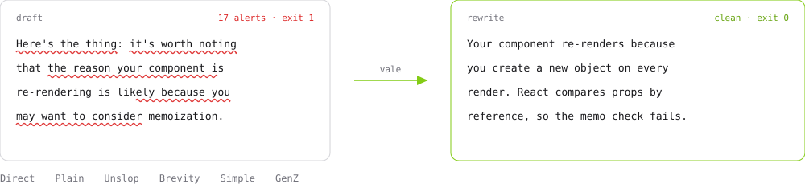

# Voices: AI output styles powered by Vale

<picture>
  <source media="(prefers-color-scheme: dark)" srcset=".github/assets/hero-dark.svg">
  
</picture>

<p align="center">
  Writing voices from the <a href="https://github.com/smixs/awesome-claude-output-styles#the-styles">output-style catalog</a>, written as <a href="https://vale.sh">Vale</a> rules instead of prompts. Checked on every draft rather than remembered, and free until something breaks one.
</p>

<div align="center">
<table>
<thead>
<tr>
<th><a href="https://vale.sh/blog/voices">Demo</a></th>
<th><a href="briefs">Briefs</a></th>
<th><a href="https://github.com/vale-cli/agent-tools">Agent tools</a></th>
<th><a href="https://vale.sh/docs/install">Install Vale</a></th>
</tr>
</thead>
</table>
</div>

## :package: Install

> Voices requires Vale v3.20.0 or later, and builds on [Std](https://github.com/vale-cli/Std),
> the standard library its length rules extend. Sync pulls Std in
> automatically; it stays present without being enabled.

```ini
Packages = https://github.com/jdkato/voices/releases/latest/download/Voices.zip

[*.md]
BasedOnStyles = Voices, Direct
```

```console
$ vale sync
```

`Voices` is the shared core and is always on. Add one voice beside it.

| Voice | From | Adds |
| ----- | ---- | ---- |
| [`Voices`](Voices/styles/Voices) | [`no-ai-slop`](https://github.com/smixs/awesome-claude-output-styles/blob/main/output-styles/no-ai-slop.md) | Inflated words, binary contrasts, throat-clearing, puffery, weasel attribution, colon reveals, recap endings, weak verbs |
| [`Direct`](Voices/styles/Direct) | [`no-slop`](https://github.com/smixs/awesome-claude-output-styles/blob/main/output-styles/no-slop.md) | No hedging, no preamble, sentences under 25 words |
| [`GenZ`](Voices/styles/GenZ) | [`gen-z`](https://github.com/smixs/awesome-claude-output-styles/blob/main/output-styles/gen-z.md), [`street`](https://github.com/smixs/awesome-claude-output-styles/blob/main/output-styles/street.md) | One slang term a sentence, two a paragraph, at least one |
| [`Coach`](Voices/styles/Coach) | [`coach`](https://github.com/smixs/awesome-claude-output-styles/blob/main/output-styles/coach.md) | One note (100 words), one image, one "Next:" action |
| [`Simple`](Voices/styles/Simple) | [`thing-explainer`](https://github.com/smixs/awesome-claude-output-styles/blob/main/output-styles/thing-explainer.md) | Only the 850 words of Basic English |

The catalog holds dozens of styles; these are the ones that convert into
rules a linter can hold. Each covers a different kind of constraint --
patterns, register, structure, vocabulary -- so they compose instead of
overlapping.

`Coach` wants `Voices.ColonReveal = NO` in your config: its required
`Next:` label is the colon reveal the shared core forbids.

See [vale.sh/blog/voices](https://vale.sh/blog/voices) for one draft run through each voice.

## :control_knobs: Tune a voice

A voice is a named setting of dials, and the dials are addressable. Levels
and toggles from your config, as always; scalars with the bracket key:

```ini
[*.md]
BasedOnStyles = Voices, Direct
Direct.Length[max] = 30
Voices.ColonReveal = NO
```

To change what a rule matches, extend it in a style of your own -- your name
on the alert, the machinery inherited:

```yaml
# styles/House/Hedging.yml
extends: Direct.Hedging
message: "We don't hedge."
level: error
tokens+:
  - perhaps the best answer is
```

```ini
[*.md]
BasedOnStyles = Voices, Direct
House.Hedging = YES
Direct.Hedging = NO
```

The pair of lines says exactly what happens: your rule in, its parent out. The
disable matters -- the child matches everything its parent does, and with both
enabled every hedge would be reported twice. Leave both on only when that's
the intent: a broad parent at `suggestion` under a narrowed child at `error`
is a legitimate shape.

## :robot: Use it with an agent

Install the [Vale agent tools](https://github.com/vale-cli/agent-tools) plugin:

```
/plugin marketplace add vale-cli/agent-tools
/plugin install vale@agent-tools
```

Every prose file Claude writes is linted, and the alerts go back into the same turn. Rules with one right answer carry the replacement, so those are applied without a decision.

> [!TIP]
> The hook relays **errors** only. `Simple` is advisory by design. Widen the hook's level in `/plugin`, or raise a rule with `Simple.Vocabulary = error`.

To prime the model as well as check it, [`briefs/`](briefs) holds a generated summary per voice: `cat briefs/Core.md briefs/Direct.md >> CLAUDE.md`.

Outside Claude Code, Vale reads stdin and sets an exit code:

```console
$ vale --ext=.md --output=JSON < draft.md
```

## :heart: Credit

The core's word lists and patterns come from [no-ai-slop](https://github.com/petergyang/no-ai-slop) by Peter Yang, MIT. The voices follow [awesome-claude-output-styles](https://github.com/smixs/awesome-claude-output-styles) by Serge Shima, also MIT. `Simple` uses Basic English, C. K. Ogden's 850-word vocabulary from 1930.

[`NOTICE`](NOTICE) has the full attribution, and ships inside the archive.

## :test_tube: Tests

```console
$ ./test.sh
```

One draft against every voice, compared to a golden file; then each rewrite, required to produce nothing. A Vale rule that matches nothing fails silently, so the paired fixture is what tells "no violations" from "no rule". `test.sh` expects a [Std](https://github.com/vale-cli/Std) checkout beside this repository, or `STD` pointing at one.

## License

MIT.
