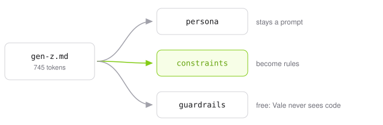

# Voices: AI output styles powered by Vale

<picture>
  <source media="(prefers-color-scheme: dark)" srcset=".github/assets/hero-dark.svg">
  
</picture>

Six voices from the [output-style catalog][catalog], written as [Vale][vale]
rules instead of prompts. The countable constraints checked exactly, every hit
reported with its span — and costing nothing until the prose breaks one.

[catalog]: https://github.com/smixs/awesome-claude-output-styles#the-styles
[vale]: https://vale.sh

```ini
Packages = https://github.com/jdkato/voices/releases/latest/download/Voices.zip

[*.md]
BasedOnStyles = Voices, Direct
```

```console
$ vale sync
```

## One draft, six voices

Each rewrite below is a file in [`fixtures/after/`](fixtures/after), produced
by running the loop until Vale returned zero. CI fails if one stops coming
back clean.

<table>
<tr>
<th align="left" width="50%">Draft &nbsp;·&nbsp; <code>exit 1</code></th>
<th align="left" width="50%"><code>Voices, Direct</code> &nbsp;·&nbsp; <code>exit 0</code></th>
</tr>
<tr valign="top">
<td>

```markdown
# Understanding Why Your Component Keeps Re-Rendering

Here's the thing: it's worth noting that the reason your
React component is re-rendering is likely because you're
creating a new object reference on each render cycle,
which breaks React's referential equality check — so you
may want to consider memoization.

This is not just a performance problem, it's a
correctness problem. Furthermore, experts agree that a
robust approach to this paradigm shift will empower your
team to streamline a number of things in the render
path, underscoring its significance.

In conclusion, the team made a decision to leverage
several caching solutions.
```

</td>
<td>

```markdown
# Understanding Why Your Component Keeps Re-Rendering

Your component re-renders because you create a new
object on every render. React compares props by
reference, and a new reference is never equal to the old
one. The memo check fails, so the child renders again.

Wrap the object in `useMemo` with the values it depends
on. If it never changes, move it out of the component.
```

</td>
</tr>
</table>

```console
$ vale draft.md
 draft.md
 3:1    error  Throat-clearing: 'Here's the thing'. Cut it and state the point.                             Voices.ThroatClearing
 3:1    error  Sentence runs to 45 words. Split it.                                                         Direct.Length
 3:19   error  Hedge: 'it's worth noting'. State it, or say why you're unsure.                              Direct.Hedging
 3:42   error  Preamble: 'the reason your React component is'. Lead with the finding.                       Direct.Preamble
 4:33   error  Hedge: 'is likely because'. State it, or say why you're unsure.                              Direct.Hedging
 7:1    error  Hedge: 'may want to consider'. State it, or say why you're unsure.                           Direct.Hedging
 9:6    error  Binary contrast: 'is not just a performance problem, it's'. State the second half directly.  Voices.BinaryContrast
 10:22  error  Sentence runs to 28 words. Split it.                                                         Direct.Length
 10:35  error  Weasel attribution: 'experts agree'. Name the source or cut the claim.                       Voices.Weasel
 11:1   error  Inflated word: use 'strong' instead of 'robust'.                                             Voices.InflatedWords
 11:25  error  Inflated word: 'paradigm shift'. Say the plain thing.                                        Voices.Banned
 11:45  error  Inflated word: 'empower'. Say the plain thing.                                               Voices.Banned
 12:9   error  Inflated word: use 'simplify' instead of 'streamline'.                                       Voices.InflatedWords
 13:5   error  Superficial analysis: ', underscoring'. Say what it does for the reader.                     Voices.SuperficialAnalysis
 15:1   error  Recap ending: 'In conclusion'. End on the last concrete point.                               Voices.Recap
 15:25  error  Weak verb phrase: use 'decided' instead of 'made a decision'.                                Voices.WeakVerbs
 15:44  error  Inflated word: use 'use' instead of 'leverage'.                                              Voices.InflatedWords

✖ 17 errors, 0 warnings and 0 suggestions in 1 file.
```

Four of those seventeen carry `action: replace` and the exact span, so an agent
applies them without spending a turn on the decision. The split is deliberate:
`InflatedWords`, `WeakVerbs` and `Nominalization` hold the words with one right
answer, and `Banned` keeps the ones that need the sentence rewritten around
them. A fix applied without thought has to be right every time.

<details>
<summary><b>Simple</b> — only the 850 words of Basic English</summary>

<br>

C. K. Ogden's 1930 vocabulary, expanded to its regular inflections and shipped
as a Hunspell dictionary. Forty-four of the fifty-five alerts here are
vocabulary; the heading had to go too.

```console
  1:3  'Understanding' is outside Basic English. Say it in shorter words.  Simple.Vocabulary
 1:26  'Component' is outside Basic English. Say it in shorter words.      Simple.Vocabulary
  3:1  'Here's' is outside Basic English. Say it in shorter words.         Simple.Vocabulary
 3:24  'worth' is outside Basic English. Say it in shorter words.          Simple.Vocabulary
  4:1  'React' is outside Basic English. Say it in shorter words.          Simple.Vocabulary
       ... 39 more
```

```markdown
# Why your page part is made again and again

Your part of the page is made again and again. Every
time it is made, you give it a new box of values. The
system does not look inside the box. It only sees that
the box is new, so it does all the work again.

Keep the same box. Make the box once, and give that same
box every time. Then the system sees no change, and it
does no work.
```

</details>

<details>
<summary><b>GenZ</b> — one slang term a sentence, two a paragraph, at least one</summary>

<br>

The source style asks the model to check its own slang density by re-reading
the draft and counting. `min` also makes an absent voice a violation. Vale
reports the shortfall once per file, at 1:1, rather than at the paragraph that
came up short.

```console
   1:1  A paragraph here has no slang. This voice is not off.  GenZ.Presence
 10:22  Corporate register: 'Furthermore'. Not this voice.      GenZ.Register
```

```markdown
# Understanding Why Your Component Keeps Re-Rendering

Your render path is cooked. You build a new object every
render, and React compares props by reference. A new
reference never equals the old one, so the memo check
fails and the child renders again.

Wrap the object in `useMemo` with the values it depends
on. Stable reference, clean diff, massive W.
```

</details>

<details>
<summary><b>Brevity</b> — six-word headlines and a required "Why it matters:"</summary>

<br>

`occurrence` with `min: 1` is the only rule shape that can require something be
*present*.

```console
   1:1  No 'Why it matters:' section. Say why the reader should care.  Brevity.WhyItMatters
   3:1  Sentence runs to 45 words. Smart Brevity caps it at twenty.    Brevity.Length
 10:22  Sentence runs to 28 words. Smart Brevity caps it at twenty.    Brevity.Length
```

```markdown
# New object, new reference

Your component re-renders because you build a new object
every render. React compares props by reference. A new
reference never equals the old one.

Why it matters: the memo check fails, so every child re-
renders on every parent render. On a large tree that is
the whole frame budget.

## The fix

Wrap the object in `useMemo` with the values it depends
on. If it never changes, move it out of the component.
```

</details>

## The voices

`Voices` is the shared core and is always on. A voice adds only what makes it
that voice.

| Voice | From | Adds | License |
| ----- | ---- | ---- | ------- |
| [`Voices`](Voices/styles/Voices) | [`no-ai-slop`](https://github.com/smixs/awesome-claude-output-styles/blob/main/output-styles/no-ai-slop.md) | Inflated words (swapped where one word is the answer), binary contrasts, throat-clearing, puffery, weasel attribution, colon reveals, recap endings, weak verbs | [MIT](https://github.com/petergyang/no-ai-slop/blob/main/LICENSE) · Yang |
| [`Direct`](Voices/styles/Direct) | [`no-slop`](https://github.com/smixs/awesome-claude-output-styles/blob/main/output-styles/no-slop.md) | No hedging, no preamble, sentences under 25 words | [MIT](https://github.com/petergyang/no-ai-slop/blob/main/LICENSE) · Yang |
| [`Plain`](Voices/styles/Plain) | [`plain-english`](https://github.com/smixs/awesome-claude-output-styles/blob/main/output-styles/plain-english.md) | Grade 12, sentences under 35 words, no passive voice, nominalizations swapped for the verb | [MIT](https://github.com/smixs/awesome-claude-output-styles/blob/main/LICENSE) · Shima |
| [`Unslop`](Voices/styles/Unslop) | [`unslop`](https://github.com/smixs/awesome-claude-output-styles/blob/main/output-styles/unslop.md) | No em dashes, sentence-case headings, no vague nouns | [MIT](https://github.com/smixs/awesome-claude-output-styles/blob/main/LICENSE) · Shima |
| [`Brevity`](Voices/styles/Brevity) | [`smart-brevity`](https://github.com/smixs/awesome-claude-output-styles/blob/main/output-styles/smart-brevity.md) | Six-word headlines, a required "Why it matters:", sentences under 20 words | [MIT](https://github.com/smixs/awesome-claude-output-styles/blob/main/LICENSE) · Shima |
| [`Simple`](Voices/styles/Simple) | [`thing-explainer`](https://github.com/smixs/awesome-claude-output-styles/blob/main/output-styles/thing-explainer.md) | Only the 850 words of Basic English | [MIT](https://github.com/smixs/awesome-claude-output-styles/blob/main/LICENSE) · Shima |
| [`GenZ`](Voices/styles/GenZ) | [`gen-z`](https://github.com/smixs/awesome-claude-output-styles/blob/main/output-styles/gen-z.md), [`street`](https://github.com/smixs/awesome-claude-output-styles/blob/main/output-styles/street.md) | One slang term a sentence, two a paragraph, at least one | [MIT](https://github.com/smixs/awesome-claude-output-styles/blob/main/LICENSE) · Shima |

Only the first row contributed text; the rest were written from the constraint
each entry describes. [`NOTICE`](NOTICE) has the full attribution.

`Unslop` needs your proper nouns in a vocabulary. It decides sentence case by
proportion, so a short heading like "Install with GitHub Actions" is correctly
cased and still fails. Declaring the terms stops it guessing:

```ini
Vocab = Project   # styles/config/vocabularies/Project/accept.txt
```

Voices can disagree. Smart Brevity's `Why it matters:` is the colon reveal the
core forbids, so `Brevity` wants `Voices.ColonReveal = NO`. Vale surfaces the
conflict and your config settles it; two contradictory lines in one prompt just
produce whichever the model weighted higher.

## What a rule can take from a prompt

<picture>
  <source media="(prefers-color-scheme: dark)" srcset=".github/assets/split-dark.svg">
  
</picture>

- **Persona** — *"answer like the group chat's most technical member."* Left
  alone. Models are good at voice.
- **Constraints** — one slang term a sentence, six words in a headline, only
  these 850 words. Stated in the prompt, then checked by the model re-reading
  its own draft and counting.
- **Guardrails** — *"slang never enters code, file paths or identifiers."* Vale
  parses the markup, so the rules only ever see prose.

The middle one is what this package takes. It splits again once you write it
out.

A budget is **counted**, and counting is exact. A sentence runs to twenty words
or it does not. A paragraph spends its slang or it does not. A word sits inside
Ogden's 850 or outside them. No model holds those reliably across a long draft,
and no rule fails at them.

Taste is **enumerated** instead. `Banned`, `Weasel`, `Puffery` and
`ThroatClearing` are lists. They catch the slop a model reaches for first and
miss the synonym it reaches for next. Worth having, and a filter rather than a
proof. The briefs mark which is which. A word list is quoted in full. A rule
that stays a pattern is described instead, and the checker reports how many it
took on trust.

## Tokens

```
no-ai-slop SKILL.md, as loaded  2,418  ████████████████████████████████████████████████████████
briefs/Core.md + Direct.md      1,058  ████████████████████████
alerts on the draft above         469  ███████████
alerts on the rewrite               0
```

The first is paid every session. So is the brief, if you take step 4 below and
paste it into `CLAUDE.md`. Of those 1,058 tokens, 806 are `Core.md`, which every
voice shares, so a second voice costs a few hundred more. The alerts are the
ones you pay only when the prose breaks a rule.

Both halves are now the same kind of document: a persona, then the constraints.
The gap is what the constraints cost when a linter holds them instead of the
model.

Real BPE counts from [`script/tokens/count.py`](script/tokens/count.py), using
OpenAI's `o200k_base` because Anthropic publishes no offline tokenizer for
Claude 3 and later. Pass `--backend anthropic` for Claude's own count. The
prompt measured is no-ai-slop's `SKILL.md` at `b53e265`, cached in-repo.

| | `Direct` | `Plain` | `Unslop` | `Brevity` | `Simple` | `GenZ` |
| --- | ---: | ---: | ---: | ---: | ---: | ---: |
| Brief | 1,058 | 1,184 | 1,063 | 1,101 | 1,027 | 1,196 |
| Alerts on the draft | 469 | 362 | 475 | 402 | 1,393 | 364 |

## Getting started

**1. Install.** Vale is a single binary — [installation](https://vale.sh/docs/install).
Add the `.vale.ini` above, then `vale sync`. That works on its own, in an editor
or in CI.

**2. Wire it into Claude Code.** The [Vale agent tools](https://github.com/vale-cli/agent-tools)
plugin carries a `PostToolUse` hook:

```
/plugin marketplace add vale-cli/agent-tools
/plugin install vale@agent-tools
```

Every prose file Claude writes gets linted, and the alerts go back into the
same turn. Needs `vale` and `jq` on `PATH`. It fires on Claude's edits, not
yours.

**3. Check which alerts reach the model.** The hook relays **errors** only by
default, and some voices are deliberately advisory:

```console
$ vale --output=JSON draft.md | jq '[.[][].Severity] | group_by(.) | map({(.[0]): length}) | add'
{ "error": 11, "warning": 44 }
```

Those 44 never arrive. Either widen the hook — `/plugin`, then set its alert
level to `warning` — or raise the rule so it is an error everywhere:
`Simple.Vocabulary = error` gives `{ "error": 55 }`. The same syntax switches
one off: `Voices.ColonReveal = NO`.

**4. Optionally, prime it too.** `cat briefs/Core.md briefs/Direct.md >> CLAUDE.md`
— the shared core plus one voice, the same pairing as `BasedOnStyles`.

The briefs are written by hand. The half that primes a model best is how the
voice should sound, and no renderer produces that. What CI checks is coverage:
[`go run ./script/brief`](script/brief) walks the rules and fails on anything a
brief leaves unsaid. Add a word to `Voices.Banned` and the build stays red until
the brief names it.

Outside Claude Code, Vale reads stdin and sets an exit code:

```console
$ vale --ext=.md --output=JSON < draft.md
```

## Tests

```console
$ ./test.sh        # every voice, before and after
$ ./test.sh -u     # rewrite the golden files
```

[`fixtures/before.md`](fixtures/before.md) is checked against each voice and
compared to a golden file; then each rewrite is checked and required to produce
nothing.

CI also runs `vale .` over this repository, using the `.vale.ini` at the root
— the same config the README hands out. The fixtures, the briefs, and the
cached upstream prompt are excluded; everything else has to pass.

The briefs get the same treatment. `go run ./script/brief` fails on a rule that
goes unnamed, or on a brief that names a rule which is not there. It also fails
when a word list changed and the prose did not. `go test ./script/brief` then
fails if that check ever stops being able to fail. Same trap, one layer up.

`./test.sh` ends on a coverage line: every rule in the package has to fire on
some fixture. This is `vale --unused` done by hand, because Vale has no such
flag and an unmatched rule leaves nothing in the output to count. Without it a
rule that can never match passes the whole suite, and three rules here had no
fixture reaching them at all.

The paired half matters because a Vale rule that matches nothing fails
silently. Four rules here were dead on arrival. A `raw:` list concatenates
rather than alternates. `metric` has no readability formulas. A token list
written in the infinitive never matches the past tense. And `Plain.Passive`
filtered on `VBD|VBZ|VBP`, which drops every perfect and progressive passive,
because the tagger calls "been" a VBN and "being" a VBG.

That last one passed the paired fixtures, because `before.md` holds no "has
been fixed" to catch it. [`fixtures/guards/`](fixtures/guards) covers the other
half: constructions each rule must leave alone, sitting next to the ones it must
flag. "cloud-based" is not slang and "mid-size" is not `mid`, while "took the L"
still counts. "Note:" is not a colon reveal and "Ordering:" still is. A guard
that stops firing is a rule that widened while nobody watched.

## Credit

The core's word list and patterns are a translation of
[no-ai-slop](https://github.com/petergyang/no-ai-slop) by Peter Yang, MIT. That
project keeps the half this cannot express: what to preserve, when a hedge is
honest, how much to change.

The voices follow
[awesome-claude-output-styles](https://github.com/smixs/awesome-claude-output-styles)
by Serge Shima, also MIT. `Simple` uses Basic English, C. K. Ogden, 1930.

Diagrams: `python3 script/assets/diagrams.py`.

## License

MIT. The license and `NOTICE` ship inside the archive too.
